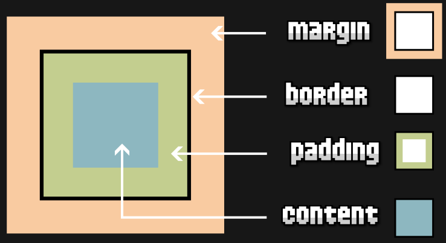
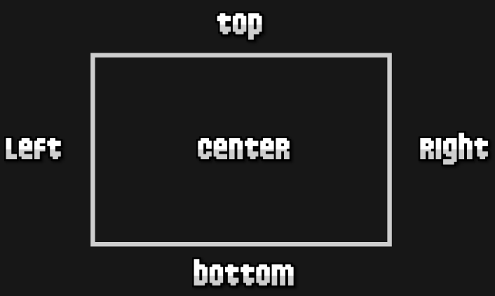

# 
Modelo de caja
### 
¿Qué es el modelo de cajas?
La representación básica del modelo de cajas se basa en varios conceptos importantes.

- **Borde** ***(Border) :***  El borde de la caja envuelve el contenido y el de relleno. Es posible controlar su tamaño y estilo utilizando la propiedad border y otras propiedades relacionadas.
- **Márgen** ***(Margin) :*** El margen es la capa más externa. Envuelve el contenido, el relleno y el borde como espacio en blanco entre la caja y otros elementos. Es posible controlar su tamaño usando la propiedad margin y otras propiedades relacionadas.
- **Relleno** ***(Padding) :***  El relleno es espacio en blanco alrededor del contenido; es posible controlar su tamaño usando la propiedad padding y otras propiedades relacionadas.
- **Contenido** ***(content) :*** El área donde se muestra el contenido, cuyo tamaño puede cambiarse utilizando propiedades como width y height.

## Dimensiones (Ancho y Alto)
Para dar tamaños específicos a los diferentes elementos de un documento HTML, necesitaremos asignarles valores a las propiedades width (ancho) y height (alto):

Propiedad    | Valor      | Significado|
-------------|------------|------------|
width|auto/size|Tamaño de ancho de un elemento|
height|auto/size|Tamaño de alto de un elemento

> En el caso de indicar el valor auto a dichas propiedades, el navegador se encargará de darle el tamaño apropiado, dependiendo de su contenido. Teniendo en cuenta que este valor es el que tienen por defecto estas propiedades. De no indicar un valor concreto, width y height tienen establecido el valor auto.

## Rango de dimensiones
Otra forma de lidiar con esto, es utilizar las propiedades hermanas de width: por un lado, min-width y max-width y por otro, sus equivalentes de height: min-height y max-height.

Propiedad|Valor|significado|
---------|-----|-----------|
max-width|none/size| Ancho máximo que puede ocupar un elemento.
min-width|0/size|Ancho mínimo que puede ocupar un elemento.
max-height|none/size|Alto máximo que puede ocupar un elemento.
min-height|0/size|Alto mínimo que puede ocupar un elemento.

> Con estas propiedades, en lugar de establecer un tamaño fijo, establecemos unos rangos máximos y mínimos, donde el ancho o alto podría variar entre esos valores:

ejemplo:
>div {
  width: 800px;
  height: 400px;
  background: red;
  max-width: 500px;
}

>Ojo: Las propiedades de mínimos min-width y min-height por defecto tienen valor 0, mientras que las propiedades de máximos max-width y max-height, tienen por defecto valor none.

## Zonas de un elemento
Es importante saber que en CSS existen ciertas palabras clave para hacer referencia a una zona u orientación concreta sobre un elemento.

Palabra clave|Descripción|
-------------|-----------|
Top|Se refiere a la parte superior del elemento.
Left|Se refiere a la parte izquierda del elemento.
Right|	Se refiere a la parte derecha del elemento.
Bottom|Se refiere a la parte inferior del elemento.
Center|En algunos casos, se refiere a la posición central entre los extremos horizontales o verticales.

fuente: https://lenguajecss.com/css/modelo-de-cajas/que-es/

# Propiedad display
Cada elemento HTML tiene un tipo de representación concreto. Como norma general (con excepciones) los elementos que se utilizan dentro de un párrafo, son de tipo inline, mientras que los que se utilizan para agrupar, son de tipo block. La propiedad display de CSS permite modificar el comportamiento de un elemento HTML, cambiándolo al que le indiquemos, como por ejemplo inline o block.

Propiedad|Valores|Descripción|
---------|-------|-----------|
display|none/**tipo**|Cambia el tipo de representación del elemento al indicado.|

Existe una amplia gama de tipos de representación de elementos HTML que podemos utilizar mediante la propiedad display.

Tipo de caja|Características|
------------|---------------|
block|Se apila en vertical. Ocupa todo el ancho disponible de su etiqueta contenedora.	
Versión en línea.
Tipo de caja|Características|
------------|---------------|
inline|Se coloca en horizontal. Se adapta al ancho de su contenido. Ignora width o height.|
inline-block|Combinación de los dos anteriores. Se comporta como inline pero no ignora width o height.	|
Versión flexible.
Tipo de caja|Características|
------------|---------------|
flex|Utiliza el modelo de cajas flexibles de CSS. Ideal para estructuras de 1 dimensión.
inline-flex|Versión en línea (ocupa sólo su contenido) del modelo de cajas flexibles de CSS.|
Versión de cuadrículas
Tipo de caja|Características|
------------|---------------|
grid|Utiliza cuadrículas o rejillas con el modelo de cajas Grid CSS.|
inline-grid|La versión en línea (ocupa sólo su contenido) del modelo de cajas grid css.|

Versión de listas y tablas
Tipo de caja|Características|
------------|---------------|
list-item|Actúa como un ítem de una lista. Es el comportamiento de etiquetas como < li >.|
table|Actúa como una tabla. Es el comportamiento de etiquetas como < table >.|	
table-cell|Actúa como la celda de una tabla. Es el comportamiento de etiquetas como < th > o < td >.|
table-row|Actúa como la fila de una tabla. Es el comportamiento de etiquetas como < tr >.

fuente: https://lenguajecss.com/css/maquetacion-y-colocacion/propiedad-display/